# [목차]
- [\[목차\]](#목차)
- [\[프로젝트명 : 트랜스폼Drone 프로젝트\]](#프로젝트명--트랜스폼Drone-프로젝트)
- [\[프로젝트 개요\]](#프로젝트-개요)
  - [프로젝트 소개](#프로젝트-소개)
  - [프로젝트 달성 목표](#프로젝트-달성-목표)
  - [\[추진 배경 및 필요성\]](#추진-배경-및-필요성)
  - [\[주요 내용\]](#주요-내용)
- [\[프로젝트 진행 상황\]](#프로젝트-진행-상황)
  - [프로젝트 수행 일정](#프로젝트-수행-일정)
  - [현재까지의 프로젝트 수행 내용](#현재까지의-프로젝트-수행-내용)
  - [현재까지의 프로젝트 성과 영상](#현재까지의-프로젝트-성과-영상)
  - [향후 계획](#향후-계획)
- [주차별 개발 내용](#주차별-개발-내용)
  - [1주차](#1주차)
  - [2주차](#2주차)
  - [3주차](#3주차)
  - [4주차](#4주차)
  - [5주차](#5주차)
  - [6주차](#6주차)
  - [7주차](#7주차)
  - [8주차](#8주차)
  - [9주차](#9주차)
# [프로젝트명 : 트랜스폼Drone 프로젝트]
트랜스폼Drone 프로젝트

# [프로젝트 개요]
### 프로젝트 소개
- 드론을 직접 만들고 조종하고 싶은 사람들을 위한 드론을 가상환경에서 체험할 수 있는 교육용 실감미디어 컨텐츠 개발

- 창의적으로 자신만의 드론을 조립하여 창의력 향상

- 현실 세계의 환경적 제약에 구애받지 않고 드론을 체험할 수 있는 경험 부여

### 프로젝트 달성 목표
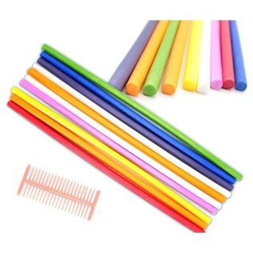 
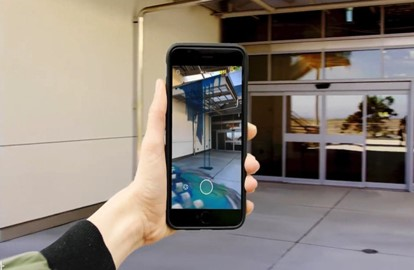 
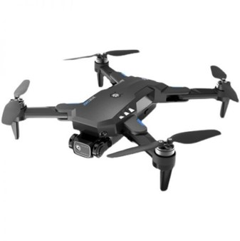 
- 여러 가지 색의 제작 키트로 드론을 만들면 색깔을 ar로 인식하여 각종 여러 부품을 가상으로 드론을 구체화시켜 게임 속 세상을 날아다니는 것을 목표로 함

### 추진 배경 및 필요성
- 사용자가 드론 조립을 통해 가상공간에서 비행함으로써 물리적인 움직임을 이해하고 문제해결 능력과 집중력, 창의력을 키울 수 있는 교육 콘텐츠 제작의 새로운 방향성 제시

- 기존의 보편적인 디지털 기반 학습 콘텐츠와는 다른, 사용자가 즐기면서 익힐 수 있는 게이미피케이션(gamification)된 교육용 콘텐츠의 개발 필요성을 느낌.

- 가상 드론 비행 시뮬레이션을 통해 드론 비행 원리를 충분히 설명하면서 유희성을 가진 경쟁력 있는 콘텐츠라고 판단

- 드론 조립에 의한 특징과 장점들을 통해서 드론 비행 원리를 설명하는 교육 AR 콘텐츠를 개발하고자 함.
 

### 주요 내용
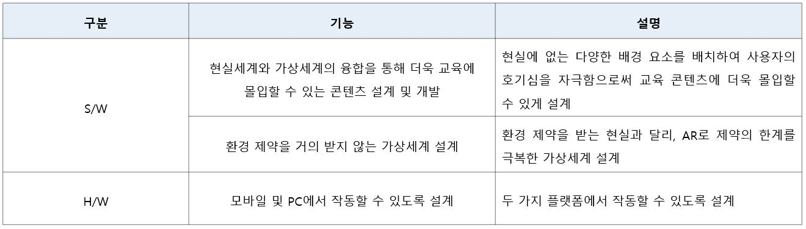 
- 게임엔진을 활용한 즉각적인 몰입감을 위한 AR 가상현실 콘텐츠 생성 기술

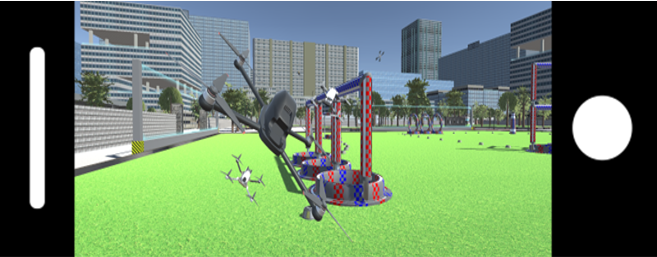 
- 모바일 플랫폼에서 콘텐츠를 사용하며, 기구로 제작된 드론을 
인식하여 가상공간에 가시화하고 사용자가 원하는 맵을 선택하여 
해당 맵에서 자유롭게 비행 시뮬레이션을 수행함.

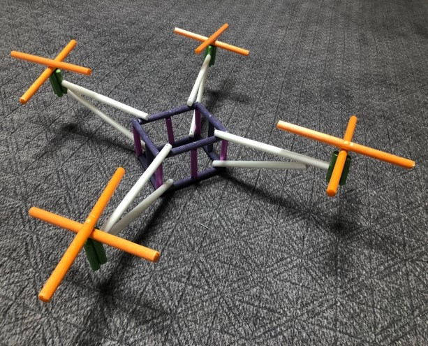 
- 현실에서 구할 수 있는 특정 기구로 드론의 외형을 조립하고 색깔로 부품을 구별하여 인식

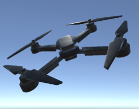 
- 현실에서 만든 모형 드론을 인식된 내용을 분석하여 3D 가상세계에서 생성

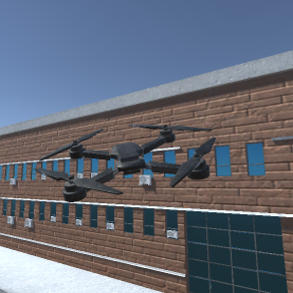 
- 사용자가 원하는 맵을 선택하여 해당 맵에서 자유롭게 비행 시뮬레이션을 수행함

### 적용 기술
- 물리 법칙을 적용한 요소 간 상호작용을 통한 게이미피케이션 기법 활용
- 유니티(Unity) 게임 엔진의 리지드바디(Rigidbody), 힌지 조인트(Hinge Joint)등의 Component를 적절히 활용하여 현실적인 물리 시뮬레이션 구현
- AR 기능을 이용한 조립 기구 인식 기능 개발
- PC과 모바일 모두에서 동작하는 크로스 플랫폼 개발 

  

# [프로젝트 진행 상황]

### 프로젝트 수행 일정
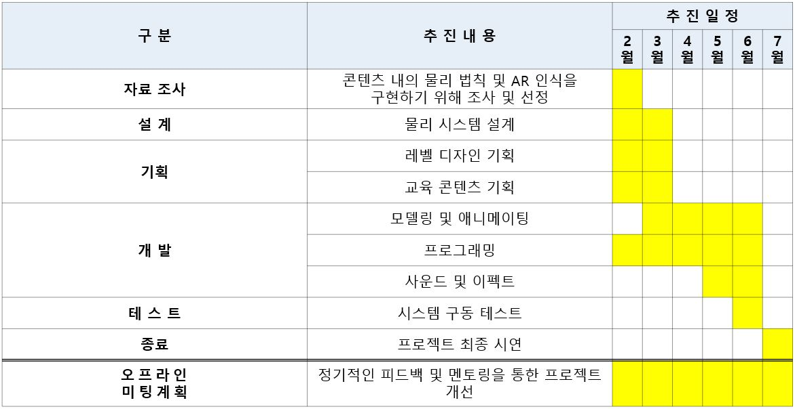 

### 현재까지의 프로젝트 수행 내용
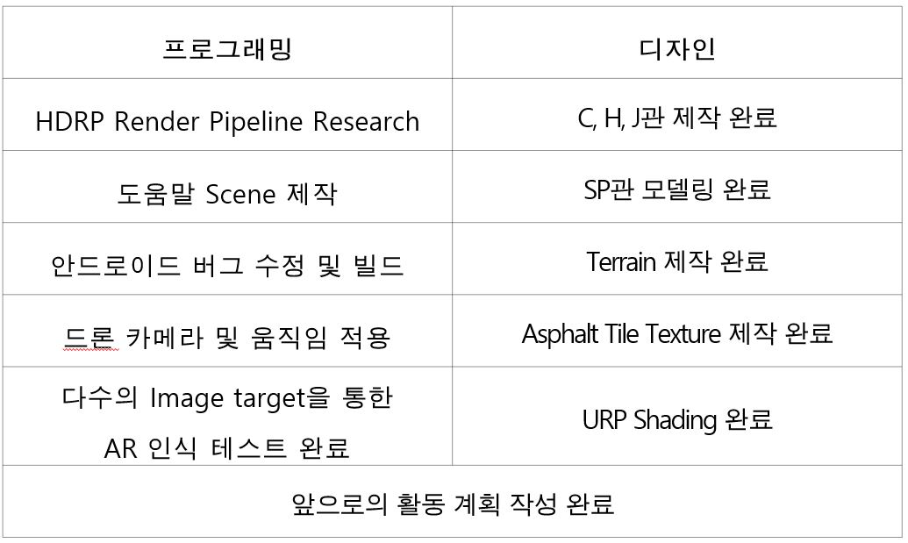 

### 현재까지의 프로젝트 성과 영상
- 유튜브 링크
- https://www.youtube.com/watch?v=M6uex-PLWYs

### 향후 계획
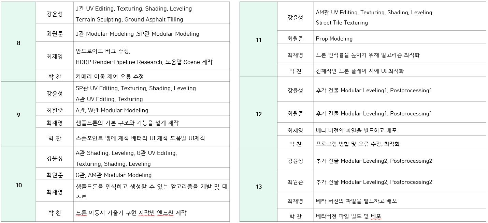 

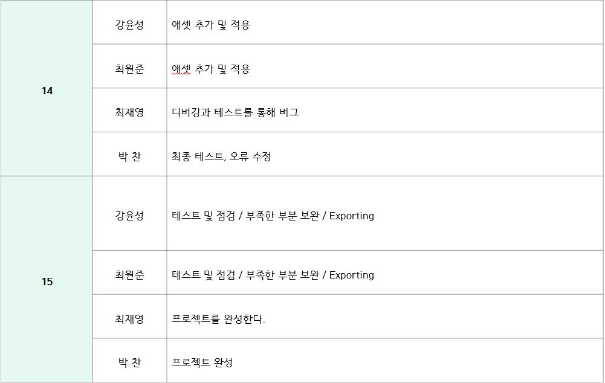 
  

# 주차별 개발 내용
## 1주차
1주차 진행내용 
오리엔테이션 진행 
팀결성 강윤성, 박찬, 최원준, 최재영 팀최강박 결성 
아이스브레이킹 

## 2주차
2주차 진행 내용 
계획서 작성 
팀원 역할 분배 
강윤성 : 보조 모델링, UV, 주Texturing, Shading, Level design 
최원준 : 주 모델링, 보조 Texturing 
박찬 : 프로그래밍 
최재영 : 프로그래밍 

## 3주차
3주차 진행 내용 
강윤성 : C관, 실외기 모델링과 C관, 실외기, 드론 Texturing을 하였음 
최원준 : C관, 드론 모델링과 샘플 드론 제작을 하였음  
박찬 : 프로그래밍 기술 조사를 하였음 
최재영 : 프로그래밍 기술 조사를 하였음 

## 4주차
4주차 진행 내용 
팀원모두 : 월간, 주간 계획표 제작 
강윤성 : 잔디, 경계석, 보도블럭제작, 레벨디자인 일부진행 
최원준 : 덤블(부쉬), 나무제작 
박찬 : 공기역학을 조사 및 코딩하여 임시드론에 적용하였음 
최재영 : AR 인식 기술에 필요한 OpenCV에 대한 조사와 개발환경 구축, 그리고 OpenCV의 함수 조사 

## 5주차
5주차 진행 내용 
그래픽부분은 이수열 교수님의 피드백을 받아 맵3개를 실제적으로 구현 이 어려울 것으로 판단되고 맵이 작아서 대학교만 전부 직접구현으로 목표를 바꾸고 나머지 맵은 에셋스토어에서 구매하여 레벨디자인을 하기로 회의를 진행하였음  
강윤성 : H관 모듈화 진행  
최원준 : C관 모듈화 진행  

클라이언트 팀 : Notion 에 있던 작업들을 각각 정의, 전제조건, 평가방법(테스트)으로 구분하여 각 작업의 필요한 내용,  결과물의 검증방법등을 알기 쉽게 정리, UI는 에셋사용.  
박찬 : 드론 움직임 오류 수정  
최재영 : Vuforia Core를 사용하여 Unity에서 AR환경구축  

## 6주차
5주차 진행 내용 
강윤성 : H관 Modeling, UV Editing, Texturing, Shading, Leveling
C관 UV Editing, Texturing, Shading   
최원준 : C관 Modeling, 전체 예상맵 제작 
박찬 : 맵 Colider 적용과 드론 카메라 및 움직임 적용 
최재영 : 다수의 image target을 설정하여 다른 이미지 인식 테스트 

## 7주차
7주차 진행 내용 
강윤성 : C, H관 UV Editing, Texturing, Shading, Leveling,Terrain Sculpting, Ground Asphalt Tile Texturing  
최원준 : J관 모델링 및 모듈화 
박 찬 : 스폰포인트 코딩 및 카메라 이동 제어 오류 수정 
최재영 : 드론 생성 씬 제작, 클라이언트 1차 병합, 안드로이드 빌드 

## 8주차
8주차 진행 내용 
 강윤성 : J관 UV Editing, Texturing, Shading, Leveling, Terrain Sculpting, Ground Asphalt Tilling 
최원준 : J관 Modular Modeling, SP관 Modular Modeling 
박 찬 : 카메라 이동 제어 오류 수정 
최재영 : 안드로이드 버그 수정, HDRP Render Pipeline Research, 도움말 Scene 제작 

## 9주차
9주차 진행 내용 
강윤성 : SP관 UV Editing, Texturing, Shading, Leveling 
최원준 : A관 Modular Modeling  
박 찬 : 스폰포인트 맵에 제작 배터리 UI 제작 도움말 UI제작 
최재영 : 샘플드론의 기본 구조와 기능을 설계 제작 

